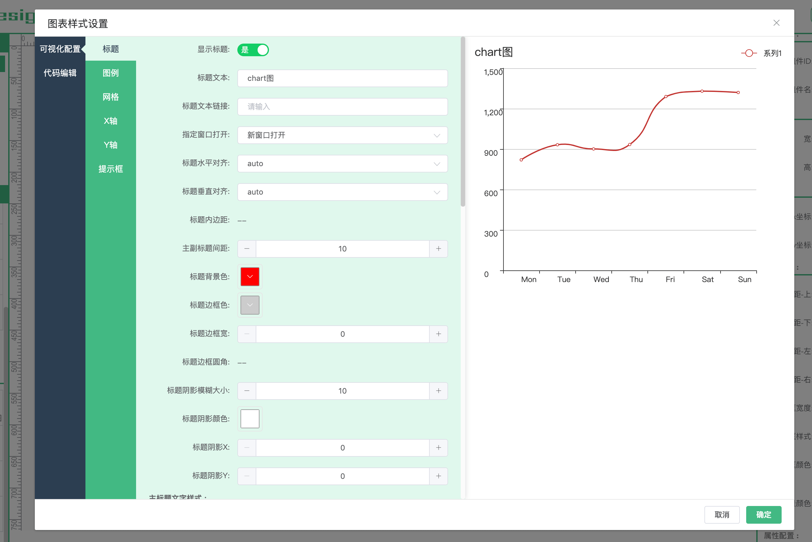
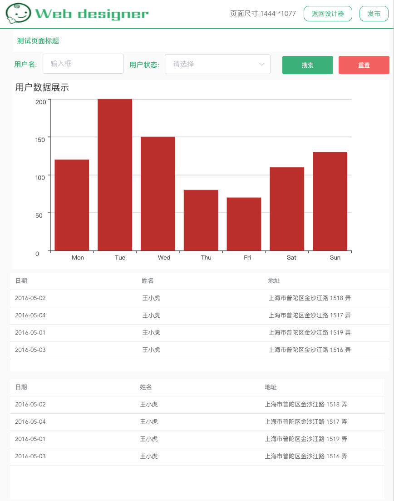
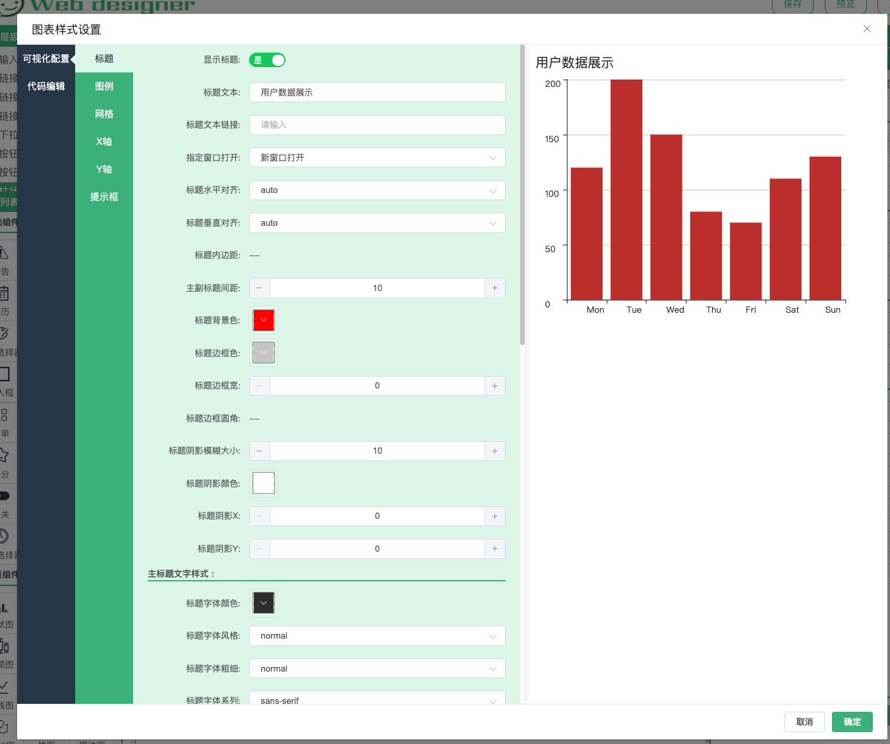
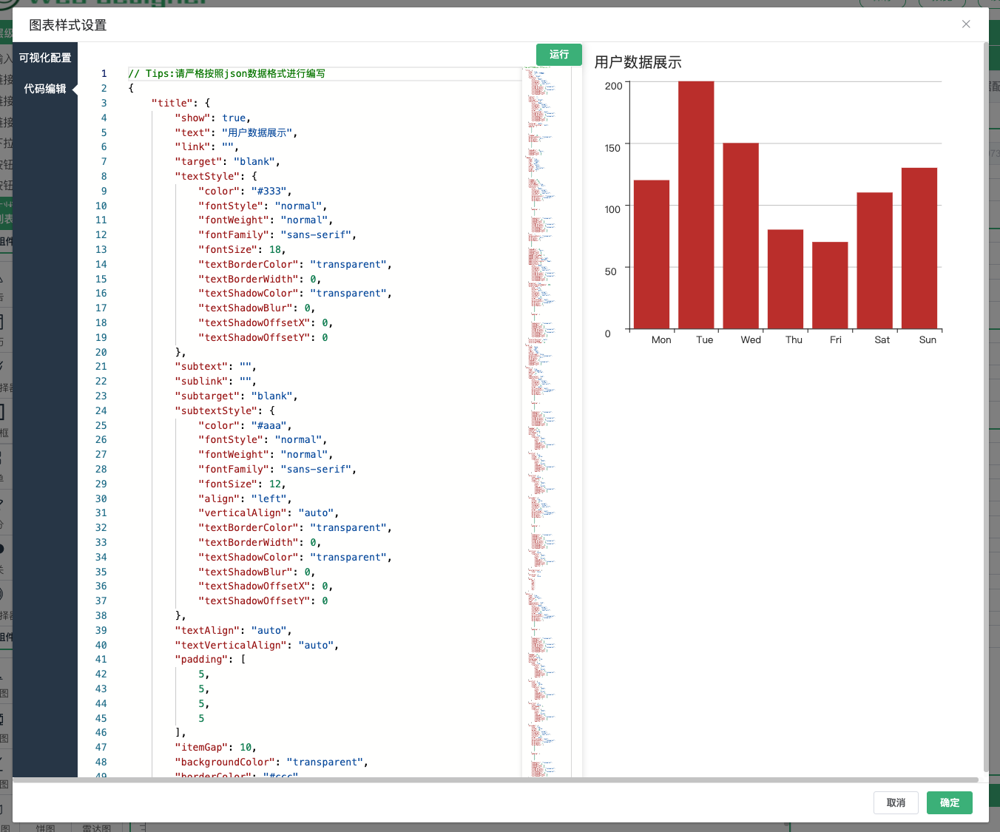
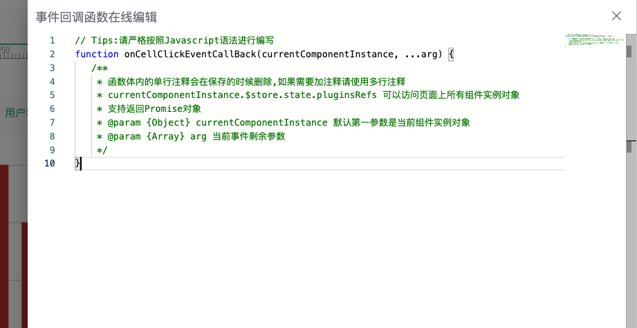
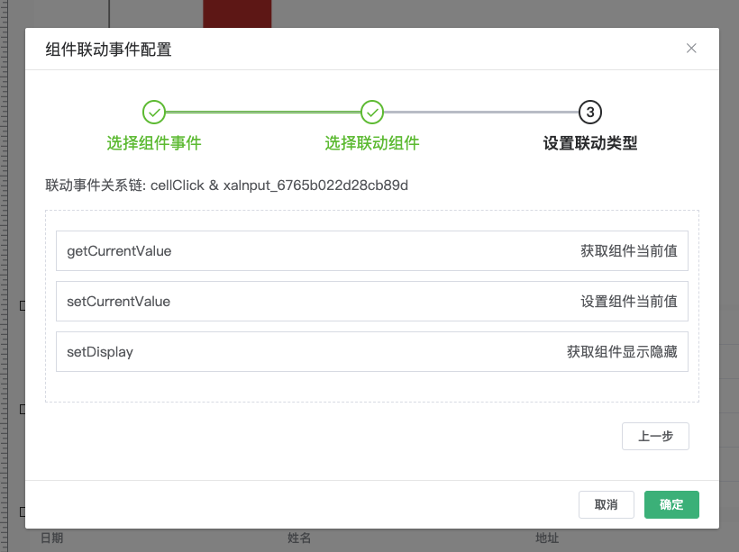
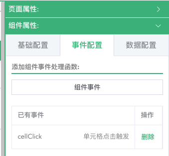
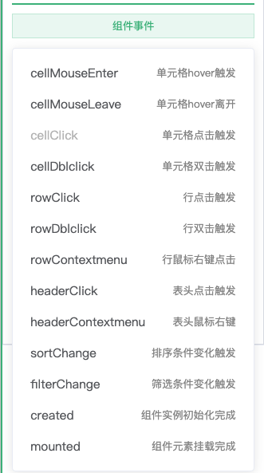
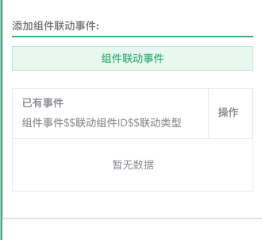

# Web Designer

[在线预览](https://xiaoai7904.github.io/web_designer)

### 项目部分截图

- 页面设计区
  
- 页面预览
  
- 图表样式设置可视化配置
  
- 图表样式设置代码编辑
  
- 组件事件配置
  
- 组件联动事件配置
  

### 简介:

- 项目使用了`Vue`进行开发
- 网页设计器图形化工具,目前内置`ElementUi`组件库
- 一键生成网页代码,支持进行二次开发
- 通过拖拽左侧组件图标,放置中间画布区,进行页面排版,设计区右侧面板可以对组件属性进行设置
- 点击右侧顶部保存按钮(数据保存在本地浏览器`localStorage`)可以进行数据保存
- 点击右侧顶部预览按钮,可以对页面布局进行预览
- 点击右侧顶部发布按钮,会调用设计器后台服务进行页面生成和代码生成,生成完成之后会在项目根目录生成`runtime/vue_cli_3.x-master`文件夹,里面的代码可以进行二次开发(基于 vue cli 3.x 版本)
- 默认发布完成之后,会打开命令行工具进行项目初始化(`npm install`)和打开项目(`npm run serve`)

### 项目运行

```
// 启用设计器
npm install
// 启用设计器后台服务(至少node 8.x),用于发布模版和生成模版代码
cd server/
npm install
npm run dev
```

### 项目目录结构

```bash
│
├── README.md                           <=  项目介绍
├── src                                 <=  项目主目录
│   ├── assets                          <=  静态资源
│   ├── components                      <=  公共组件
│   │   ├── codeEditor                  <=  代码编辑组件
│   │   ├── componentsList              <=  左侧组件列表组件
│   │   ├── designerContent             <=  中间设计区
│   │   ├── draggableResizable          <=  组件拖拽组件
│   │   ├── itemList                    <=  组件属性配置组件(参考下拉菜单,单选框,复现框属性配置)
│   │   ├── pageAutoView                <=  页面自适应组件
│   │   ├── pageCanvas                  <=  中间设计区
│   │   ├── pageDialogView              <=  系统弹窗代理组件
│   │   ├── pageFormView                <=  系统表单组合组件
│   │   ├── pageIconsView               <=  系统icon图标组件
│   │   ├── pageSwitch                  <=  系统开关组件
│   │   ├── styleSetting                <=  图表样式设置组件
│   │   ├── index.js                    <=  公共组件入口文件
│   ├── directive                       <=  系统内置指令
│   │   ├── dragDialog                  <=  拖拽弹窗
│   │   ├── index.js                    <=  指令入口文件
│   ├── modules                         <=  系统模块
│   │   ├── configuration               <=  组件配置
│   │   ├── echartBase                  <=  图表基类
│   │   ├── http                        <=  请求模块
│   │   ├── observer                    <=  事件监听模块
│   │   ├── page                        <=  页面基类
│   │   ├── pageEventManage             <=  页面事件处理模块
│   │   ├── plugins                     <=  组件基类
│   │   ├── systemLoader                <=  系统加载器
│   │   ├── utils                       <=  工具类
│   │   ├── vuePropertyDecorator        <=  vue属性装饰器
│   ├── plguins                         <=  系统内置组件
│   ├── rumtimeComponents               <=  运行态组件
│   ├── styles                          <=  系统样式
│   ├── views                           <=  页面
│   │   ├── designerPage                <=  设计器页面
│   │   ├── preview                     <=  预览页面
│   ├── App.vue                         <=  页面组件文件
│   ├── main.js                         <=  系统主入口文件
│   ├── router.js                       <=  路由配置文件
│   ├── store.js                        <=  数据管理
├── server                              <=  服务器主目录(详细参考 https://eggjs.org/zh-cn/)
├── publilc                             <=  项目静态文件目录
│   ├── index.html                      <=  项目主页面入口
│   ├── favicon.ico                     <=  浏览器页签logo
├── vue.config.js                       <=  vue打包,启动等配置(详细参数 https://cli.vuejs.org/zh/config/)
├── package.js                          <=  项目跟踪依赖关系和元数据配置文件
│
```

### 项目使用介绍

##### 组件事件配置

1.点击组件事件按钮进行配置
<br/>

<br/>
2.选择对应组件事件进行
<br/>

<br/>
3.编写对应事件处理函数
<br/>

<br/>
- 函数接受多个参数,默认第一个参数是当前组件实例对象,可以通过该参数调用组件方法和修改组件属性,

- `currentComponentInstance.$store.state.pluginsRefs`可以访问页面上面所有组件实例

- 函数支持返回`Promise`对象,可以在该函数体内进行数据请求和数据修改操作

配置的事件回调函数是在组件对应事件触发时调用

事件配置实现思路用表格组件为例展示部分代码:

```javascript
// table.vue部分代码
export default {
  mixins: [pluginsMixins],
  methods: {
    // 当某个单元格被点击时会触发该事件
    cellClickEvent(row, column, cell, event) {
      this.eventFunctionHandler('cellClick', row, column, cell, event);
    },
  },
  render(h) {
    return <el-table onCell-click={this.cellClickEvent} />;
  },
};
// pluginsMixins部分代码
export default {
  methods: {
    // 组件事件处理函数
    eventFunctionHandler(eventName, ...arg) {
      if (!eventName) return;
      // this.custom.eventListener保存了组件配置函数回调
      this.custom.eventListener[eventName] && this.custom.eventListener[eventName](this, ...arg);
      this.linkageEventFunctionHandler(eventName);
    },
  },
};
```

##### 组件联动事件配置

1.点击组件联动事件按钮进行配置
<br/>

<br/>
2.选择联动关系
<br/>

<br/>
3.编写对应事件处理函数
<br/>

<br/>

```javascript
// pluginsMixins联动事件处理函数代码
export default {
  methods: {
    // 联动事件处理函数
    linkageEventFunctionHandler: async function(eventName) {
      let i = -1;
      let items = Object.keys(this.custom.eventListener).filter((item) => item.indexOf(`${eventName}$$`) > -1);
      let len = items.length;
      this.linkageEventBackValueStack = [];

      while (++i < len) {
        let item = items[i];
        let levels = item.split('$$');
        let refs = this.$store.state.pluginsRefs;
        levels.shift();

        let componentId = levels[0];
        let componentEventCallbackName = levels[1];

        // 根据配置调用对应组件函数
        if (refs[componentId] && typeof refs[componentId][componentEventCallbackName] === 'function') {
          let result = await this.custom.eventListener[item](this);
          let backValue = refs[componentId][componentEventCallbackName](result);

          if (typeof backValue !== undefined) {
            // 执行联动事件后如果有返回值,存储当前返回值，
            // 如果下一个联动事件需要用到上一次的值可以在当前执行函数参数里面拿到当前组件实例
            // 联动函数默认第一个参数是当前组件实例对象
            this.linkageEventBackValueStack.push(backValue);
          }
        }
      }

      return this.linkageEventBackValueStack;
    }
  },
};
```
联动事件配置处理思路:
* 配置联动层级链,配置后后存储在组件`custom.eventListener`对象里面

-格式: `click$$xaInput_e26298d99bd3ac03$$getCurrentValue: 'function event() {}'`

-格式说明: `组件事件$$联动组件Id$$联动类型`

* 通过解析组件配置的联动事件,在`this.$store.state.pluginsRefs`所有组件实例对象中去执行对应联动组件联动类型函数
* 执行联动函数顺序是按照配置顺序执行,每执行一步如果函数有返回值会存储在联动事件返回值存储器`linkageEventBackValueStack`中,可以在联动事件处理函数体内通过第一个参数`currentComponentInstance.linkageEventBackValueStack`拿到上次函数返回值,也可以继续一直链式返回

> Tips: 组件事件配置和联动事件配置运行器暂时没有实现

### 后期版本规划

- H5 页面生成器
- 项目优化
- ...

### 更新日志

- 2019-03-25 项目初始化
- 2019-04-20 新增拖拽组件进行排版,修改页面,组件属性
- 2019-04-23 新增排版辅助线和预览功能
- 2019-04-24 新增 inputNumber,radio 组件
- 2019-05-15 新增 icon 图标选择器,画布区支持复制(Ctrl + c),粘贴(Ctrl + v)
- 2019-11-20 新增按钮,链接,日期,时间,评分,警告,面包屑,日历,复选框,折叠,颜色选择器,进度条,下拉菜单,滑块,Tag
- 2019-11-28 新增表格,树形控件,菜单组件和 json 编辑器(基于 monaco-editor)
- 2019-12-14 新增一键生成页面和代码(基于`Vue cli 3.x`)
- 2020-03-11 新增容器组件和图表组件,图表组件样式支持可视化配置
- 2020-07-26 新增组件事件配置和联动事件配置
