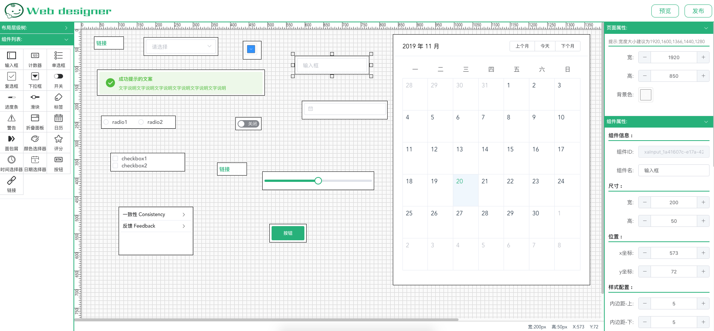

# Web Designer


[在线预览](https://xiaoai7904.github.io/web_designer)

### 项目截图

### 介绍: 
* 项目使用了`Vue`进行开发
* 网页设计器图形化工具,目前内置`ElementUi`组件库
* 支持上传自定义组件,一键生成网页代码,支持进行二次开发

### 项目运行
```
npm install
or
yarn
```

### 编译开发
```
npm run serve
or
yarn serve
```

### 编译打包
```
npm run build
or
yarn build
```
### 后期版本规划
* 一键生成页面和代码(基于`Vue cli 3.x`)
* 支持回退功能(Ctrl + z),前进(Ctrl + y)
* 上传自定义组件(需按照特定组件开发规则进行开发)
* 支持配置自定义事件(组件之间进行交互)
* 数据图表支持(Echarts,AntV)
* 内置页面模版(基于本项目配置的页面模版,可直接使用进行二次排版)
* ...

### 更新日志
* 2019-03-25 项目初始化
* 2019-04-20 新增拖拽组件进行排版,修改页面,组件属性
* 2019-04-23 新增排版辅助线和预览功能
* 2019-04-24 新增inputNumber,radio组件
* 2019-05-15 新增icon图标选择器,画布区支持复制(Ctrl + c),粘贴(Ctrl + v)
* 2019-11-20 新增按钮,链接,日期,时间,评分,警告,面包屑,日历,复选框,折叠,颜色选择器,进度条,下拉菜单,滑块,Tag组件